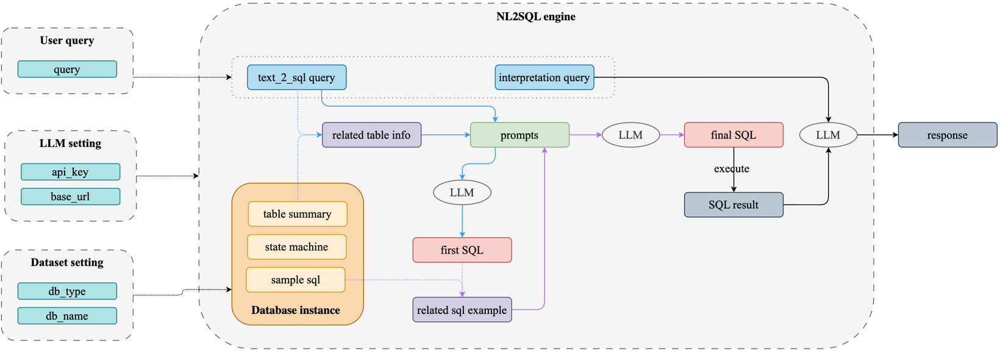
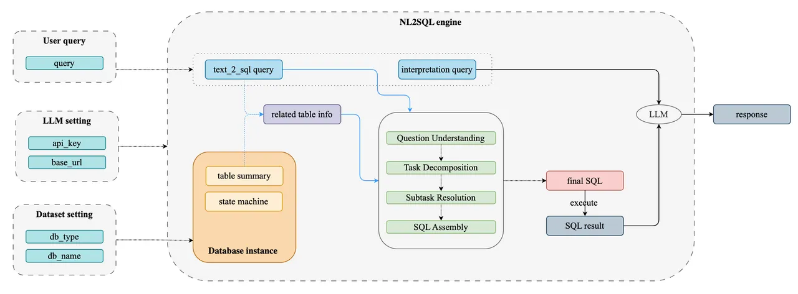

# PY-NL2SQL: 开箱即用的自然语言到SQL查询生成的Python库


<div align="center">
  <p>
    <a href="https://opensource.org/licenses/MIT">
      
    </a>
     <a href="https://github.com/pillarliang/py-nl2sql/releases">
      
    </a>
    <a href="https://github.com/eosphoros-ai/DB-GPT/issues">
      
    </a>
    <a href="https://discord.gg/7uQnPuveTY">
      
    </a>
    <a href="https://codespaces.new/pillarliang/py-nl2sql">
      
    </a>
  </p>

[**English**](README_EN.md) | [**中文**](README.md)
</div>


## 目录
- [架构方案](#架构方案)
- [安装与使用](#安装与使用)
- [使用说明](#使用说明)


## 安装与使用

使用的 MySQL 数据集：[MySQL Sample Database](https://www.mysqltutorial.org/getting-started-with-mysql/mysql-sample-database/)。可自行下载导入测试。

```Shell
mysql -u root -p classicmodels < data.sql
```

```python
# pip install py_nl2sql  
from py_nl2sql import LLM,DBInstance,NL2SQLWorkflow

llm = LLM() 
instance = DBInstance(
    db_type="mysql",     
    db_name="classicmodels",     
    need_sql_sample=True,     
    db_user="root",     
    db_password="",     
    db_host="127.0.0.1",     
    db_port="3306",     
    llm=llm, 
   )  
query = "what is price of `1968 Ford Mustang`" 
service = NL2SQLWorkflow(instance, query, llm)
res = service.get_response() 
print(res)
```


## 使用说明

在使用本项目时，用户需要提供以下三部分信息：
### 1. OpenAI Key

  用户可以通过两种方式提供 `api_key` 和 `base_url`：直接传入参数，或在环境变量中设置 `OPENAI_API_KEY` 和 `OPENAI_BASE_URL`。

   - 目前，本项目所使用的大模型仅兼容 OpenAI 模型，后续将支持本地模型及其他模型。
- 由于需要使用 OpenAI 的结构化输出特性，默认模型设定为 `gpt-4o-mini`。
 ```python
  from py_nl2sql.models.llm import LLM base_url
  
  llm = LLM(api_key="sk-xx",base_url="https://xxx")
 ```

### 2. 数据库配置信息

在新建数据库实例时，需要传入 LLM（大语言模型）。在实例化过程中，将执行以下操作：
   1. 使用嵌入（embedding）模型将数据库表信息进行嵌入处理，并将结果存储到向量数据库中（此步骤为必选）。
2. 根据数据库信息生成样本 SQL，以便后续将用户查询转换为 SQL 时作为参考（此步骤为可选）。默认情况下，该功能是开启的；如果不需要生成样本 SQL，可以将 `need_sql_sample` 设置为 `False`。
 ```python
 instance = DBInstance(
     db_type="mysql",
     db_name="classicmodels",
     need_sql_sample=True,
     db_user="root",
     db_password="",
     db_host="127.0.0.1",
     db_port="3306",
     llm=llm,
 )
 ```

  **特性：** 
  1. 支持初始化多个数据库实例，以便在存在多个数据库的情况下进行管理。 
  2. 如果数据库发生变动，可以直接调用 instance.db_update() 方法对数据库进行更新。更新过程中，将重新将数据库表信息进行嵌入处理，并存储到向量数据库中。
说明：
DBInstance 的设计采用多例模式 + 状态机。根据 db_type + db_name 实例化不同的对象。

### 3. 用户查询
用户只需传入要查询的数据库实例及相应的查询语句，然后调用 `get_response()` 方法即可获取最终结果。
```python
service = NL2SQLWorkflow(instance, query) 
res = service.get_response()
```
同时，NL2SQLWorkflow 对象中保存了一系列中间过程的元信息，例如
```sql
service.text_to_sql_query # used for sql generation
service.interpretation_query # used for final response generation
service.related_table_summary  # Table information related to the query
service.first_sql_query  # SQL query generated from the query for the first time
service.final_sql_query  # SQL query generated from the query using the similarity SQL
...
```


## 架构方案

### 原始方案：

<p align="center">
  
</p>

#### 1. 准备 3 部分数据:

- 数据库配置(host,port,user,passport,etc.) 
- OpenAI key 
- 用户 query

#### 2.连接数据库获取数据库表信息，

**A. 获取数据表信息（table summary），示例如下：**

```python
[
    'customers(customerNumber, customerName, contactLastName, contactFirstName, phone, addressLine1, addressLine2, city, state, postalCode, country, salesRepEmployeeNumber, creditLimit), and index keys: salesRepEmployeeNumber(`salesRepEmployeeNumber`) ', 
    'employees(employeeNumber, lastName, firstName, extension, email, officeCode, reportsTo, jobTitle), and index keys: officeCode(`officeCode`) , reportsTo(`reportsTo`) ', 'offices(officeCode, city, phone, addressLine1, addressLine2, state, country, postalCode, territory)', 
    'orderdetails(orderNumber, productCode, quantityOrdered, priceEach, orderLineNumber), and index keys: productCode(`productCode`) ', 
    'orders(orderNumber, orderDate, requiredDate, shippedDate, status, comments, customerNumber), and index keys: customerNumber(`customerNumber`) ', 
    'payments(customerNumber, checkNumber, paymentDate, amount)', 
    'productlines(productLine, textDescription, htmlDescription, image)', 
    'products(productCode, productName, productLine, productScale, productVendor, productDescription, quantityInStock, buyPrice, MSRP), and index keys: productLine(`productLine`) '
]
```

 可参考 Python 算法如下，其他语言自行调整：

```Python
summary_template: str = "{table_name}({columns})"

def _parse_table_summary(
        self, summary_template: str, table_name: str
) -> str:
    """Get table summary for table.
    🌟Developed by pillar🌟

    Args:
        summary_template (str): summary template
        table_name (str): table name

    Examples:
        table_name(column1(column1 comment),column2(column2 comment),
        column3(column3 comment) and index keys, and table comment: {table_comment})
    """
    columns = []
    for column in self.get_columns(table_name):
        if column.get("comment"):
            columns.append(f"{column['name']} ({column.get('comment')})")
        else:
            columns.append(f"{column['name']}")

    column_str = ", ".join(columns)
    # Obtain index information
    index_keys = []
    raw_indexes = self.get_indexes(table_name)
    for index in raw_indexes:
        if isinstance(index, tuple):  # Process tuple type index information
            index_name, index_creation_command = index
            # Extract column names using re
            matched_columns = re.findall(r"\(([^)]+)\)", index_creation_command)
            if matched_columns:
                key_str = ", ".join(matched_columns)
                index_keys.append(f"{index_name}(`{key_str}`) ")
        else:
            key_str = ", ".join(index["column_names"])
            index_keys.append(f"{index['name']}(`{key_str}`) ")
    table_str = summary_template.format(table_name=table_name, columns=column_str)
    if len(index_keys) > 0:
        index_key_str = ", ".join(index_keys)
        table_str += f", and index keys: {index_key_str}"
    try:
        comment = self.get_table_comment(table_name)
    except Exception:
        comment = dict(text=None)
    if comment.get("text"):
        table_str += f", and table comment: {comment.get('text')}"
    return table_str
```

 将数据库表信息存入 vector database，并建立索引 table summary。（工程上怎么实现根据语言自己考虑）

**B. 根据数据库信息生成样本 sql**

 生成 SQL 需要 LLM：

- 输入：table_info + prompt

  -   Table info 是上面每一个表的 DDL + 样本。（Python 有包可以用）

    ```Python
    CREATE_SAMPLE_SQL_FROM_TABLE = """
    You're a SQL expert. Given the DDL of a table and sample data in the table, write 1-5 representative SQL queries.
    These SQL queries should cover all the data in the table and provide useful information.
    
    
    Input: table information: {table_info}
    
    Output: list of SQL queries
    """
    ```

  - Table info 如下：

    ```python
     'CREATE TABLE customers (\n'
     '\t`customerNumber` INTEGER NOT NULL, \n'
     '\t`customerName` VARCHAR(50) NOT NULL, \n'
     '\t`contactLastName` VARCHAR(50) NOT NULL, \n'
     '\t`contactFirstName` VARCHAR(50) NOT NULL, \n'
     '\tphone VARCHAR(50) NOT NULL, \n'
     '\t`addressLine1` VARCHAR(50) NOT NULL, \n'
     '\t`addressLine2` VARCHAR(50), \n'
     '\tcity VARCHAR(50) NOT NULL, \n'
     '\tstate VARCHAR(50), \n'
     '\t`postalCode` VARCHAR(15), \n'
     '\tcountry VARCHAR(50) NOT NULL, \n'
     '\t`salesRepEmployeeNumber` INTEGER, \n'
     '\t`creditLimit` DECIMAL(10, 2), \n'
     '\tPRIMARY KEY (`customerNumber`), \n'
     '\tCONSTRAINT customers_ibfk_1 FOREIGN KEY(`salesRepEmployeeNumber`) '
     'REFERENCES employees (`employeeNumber`)\n'
     ')ENGINE=InnoDB COLLATE utf8mb4_0900_ai_ci DEFAULT CHARSET=utf8mb4\n'
     '\n'
     '/*\n'
     '3 rows from customers table:\n'
     'customerNumber\tcustomerName\tcontactLastName\tcontactFirstName\tphone\t'
     'addressLine1\taddressLine2\tcity\tstate\tpostalCode\tcountry\t'
     'salesRepEmployeeNumber\tcreditLimit\n'
     '103\tAtelier graphique\tSchmitt\tCarine \t40.32.2555\t54, rue Royale\tNone\t'
     'Nantes\tNone\t44000\tFrance\t1370\t21000.00\n'
     '112\tSignal Gift Stores\tKing\tJean\t7025551838\t8489 Strong St.\tNone\tLas '
     'Vegas\tNV\t83030\tUSA\t1166\t71800.00\n'
     '114\tAustralian Collectors, Co.\tFerguson\tPeter\t03 9520 4555\t636 St Kilda '
     'Road\tLevel 3\tMelbourne\tVictoria\t3004\tAustralia\t1611\t117300.00\n'
    ```

- 输出：生成的sql 样式如下：

  ```Python
  [
  'SELECT * FROM customers;',
   'SELECT customerName, city, country FROM customers WHERE creditLimit > 50000;',
   'SELECT city, COUNT(*) AS customer_count FROM customers GROUP BY city;',
   'SELECT customerName, contactFirstName, contactLastName FROM customers WHERE salesRepEmployeeNumber IS NOT NULL;',
   'SELECT country, AVG(creditLimit) AS average_credit_limit FROM customers GROUP BY country;',
   'SELECT * FROM employees;',
   "SELECT lastName, firstName, email FROM employees WHERE officeCode = '1';",
   'SELECT COUNT(*) AS totalEmployees FROM employees;',
   'SELECT jobTitle, COUNT(*) as employeeCount FROM employees GROUP BY jobTitle;',
   'SELECT e1.firstName AS EmployeeName, e2.firstName AS ManagerName FROM employees e1 LEFT JOIN employees e2 ON e1.reportsTo = e2.employeeNumber;',
   'SELECT * FROM offices;',
     ...
   ]
  ```

  将样本 sql 存入 vector database，并建立索引 sample_sql。（工程上怎么实现根据语言自己考虑）

#### 3. 将 query 通过 LLM 拆分为用于sql 查询 和 生成最终响应的两条 query。

1. 输入：原始 query
2. 输出：text_to_sql_query 和 interpretation_query。都是字符串类型

```Python
DECOMPOSE_QUERY_FOR_SQL = """
  Your task is to decompose the given question into the following two questions.

  1. Question in natural language that needs to be asked to retrieve results from the table.
  2. Question that needs to be asked on the top of the result from the first question to provide the final answer.

  Example:

  Input:
  How is the culture of countries whose population is more than 5000000

  Output:
  1. Get the reviews of countries whose population is more than 5000000
  2. Provide the culture of countries
  
  Question: {question}
"""
```

 **示例：**

 输入：give me details of customer and their order count

 输出：first_sql_query = 'Get the details of customers and their order count'

 interpretation_query = 'Provide the order count for each customer'

#### 4. 将 text_to_sql_query 与 2.A中的 table summary 做向量查询，获取最相似  related table summary.

#### 5. 将 text_to_sql_query + related table summary 构造 prompt 给 LLM 输出一阶段 sql

```Python
GENERATE_SQL = """
    You are a MySQL expert. 

    Given an input question, first create a syntactically correct MySQL query to run, then look at the results of the query and return the answer to the input question.

    Unless the user specifies in the question a specific number of examples to obtain, query for at most 5 results using the LIMIT clause as per MySQL. 

    You can order the results to return the most informative data in the database.

    Never query for all columns from a table. You must query only the columns that are needed to answer the question. 
    Wrap each column name in backticks (`) to denote them as delimited identifiers.

    Pay attention to use only the column names you can see in the tables below. Be careful to not query for columns that do not exist. Also, pay attention to which column is in which table.

    Pay attention to use CURDATE() function to get the current date, if the question involves "today".

    Use the following format:

    Question: Question here
    SQLQuery: SQL Query to run

    Only use the following tables:
    {table_info}

    Question: {input}
"""
```

 输出：sql (字符串)

#### 6. 将 一阶段SQL 与 2.B 中的 sample SQL 做向量查询，获取 related_sample_sql.

#### 7. 将 text_to_sql_query + related_sample_sql（from 6.）+ related table summary(from 2.A) 构造prompt 给 LLM，生成最终 SQL

 Prompt 如下：

```Python
GENERATE_SQL_WITH_SIMILARITY = """
    You are a MySQL expert. 

    Given an input question, first create a syntactically correct MySQL query to run, then look at the results of the query and return the answer to the input question.

    Unless the user specifies in the question a specific number of examples to obtain, query for at most 5 results using the LIMIT clause as per MySQL. 

    You can order the results to return the most informative data in the database.

    Never query for all columns from a table. You must query only the columns that are needed to answer the question. 
    Wrap each column name in backticks (`) to denote them as delimited identifiers.

    Pay attention to use only the column names you can see in the tables below. Be careful to not query for columns that do not exist. Also, pay attention to which column is in which table.

    Pay attention to use CURDATE() function to get the current date, if the question involves "today".

    Use the following format:

    Question: Question here
    SQLQuery: SQL Query to run


    Only use the following tables:
    {table_info}

    Similarity SQL for reference:
    {similarity_sql}

    Question: {input}
"""
```

#### 8. 执行最终 SQL 获取 SQL 查询结果

#### 9. 将SQL result(from 8.) + interpretation_query(from 3.) 构造prompt 给 LLM，生成最终结果

```Python
SQL_QUERY_ANSWER = """
    Given the following user question, corresponding SQL query, and SQL result, answer the user question.

    Question: {question}
    SQL Query: {sql_query}
    SQL Result: {sql_result}
    Answer: 
"""
```


## DIN-SQL

<p align="center">
  
</p>

详细内容与实现：[DIN-SQL](./py_nl2sql/core/din_sql/readme.md)


## Other

### 一些难搞的点：

**表之间的相关性，相关性不大都好，表结构复杂，又有相关性，**

**Text2SQL** **目前还是采用** **RAG** **的方式**:

- 查询问题怎么与DDL语句关联起来（找表找字段找关联关系）；
  - 关键词匹配，做**schema**映射

- 表之间的相关性如何提醒：
  - 可以给一些样本 sql 让它学习（目前样本 SQL 都是基于单表的）

- 表间关系用 **graph** 表示

- 建立专用名词库，对用户查询中的拼写错误做纠正。


## Licence

The MIT License (MIT)
