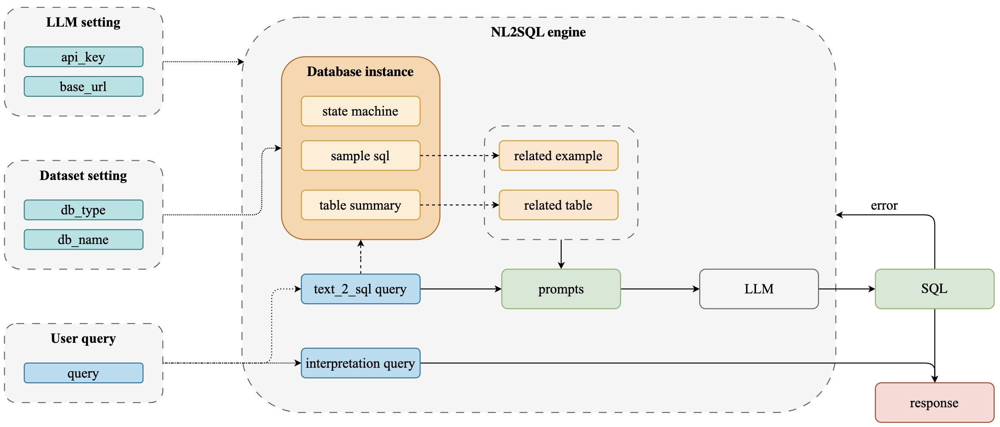

# PY-NL2SQL: 开箱即用的自然语言到SQL查询生成的Python库


<div align="center">
  <p>
    <a href="https://opensource.org/licenses/MIT">
      
    </a>
     <a href="https://github.com/pillarliang/py-nl2sql/releases">
      
    </a>
    <a href="https://github.com/eosphoros-ai/DB-GPT/issues">
      
    </a>
    <a href="https://discord.gg/7uQnPuveTY">
      
    </a>
    <a href="https://codespaces.new/pillarliang/py-nl2sql">
      
    </a>
  </p>

[**English**](README_EN.md) | [**中文**](README.md)
</div>


## 目录
- [架构方案](#架构方案)
- [安装与使用](#安装与使用)
- [使用说明](#使用说明)

## 架构方案

<p align="center">
  
</p>


## 安装与使用
```python
# pip install py_nl2sql  
from py_nl2sql import LLM,DBInstance,NL2SQLWorkflow

llm = LLM() 
instance = DBInstance(
    db_type="mysql",     
    db_name="classicmodels",     
    need_sql_sample=True,     
    db_user="root",     
    db_password="",     
    db_host="127.0.0.1",     
    db_port="3306",     
    llm=llm, 
   )  
query = "what is price of `1968 Ford Mustang`" 
service = NL2SQLWorkflow(instance, query, llm)
res = service.get_response() 
print(res)
```
## 使用说明

在使用本项目时，用户需要提供以下三部分信息：
### 1. OpenAI Key

  用户可以通过两种方式提供 `api_key` 和 `base_url`：直接传入参数，或在环境变量中设置 `OPENAI_API_KEY` 和 `OPENAI_BASE_URL`。

   - 目前，本项目所使用的大模型仅兼容 OpenAI 模型，后续将支持本地模型及其他模型。
- 由于需要使用 OpenAI 的结构化输出特性，默认模型设定为 `gpt-4o-mini`。
 ```python
  from py_nl2sql.models.llm import LLM base_url
  
  llm = LLM(api_key="sk-xx",base_url="https://xxx")
 ```

### 2. 数据库配置信息

在新建数据库实例时，需要传入 LLM（大语言模型）。在实例化过程中，将执行以下操作：
   1. 使用嵌入（embedding）模型将数据库表信息进行嵌入处理，并将结果存储到向量数据库中（此步骤为必选）。
2. 根据数据库信息生成样本 SQL，以便后续将用户查询转换为 SQL 时作为参考（此步骤为可选）。默认情况下，该功能是开启的；如果不需要生成样本 SQL，可以将 `need_sql_sample` 设置为 `False`。
 ```python
 instance = DBInstance(
     db_type="mysql",
     db_name="classicmodels",
     need_sql_sample=True,
     db_user="root",
     db_password="",
     db_host="127.0.0.1",
     db_port="3306",
     llm=llm,
 )
 ```
   
  特性： 
  1. 支持初始化多个数据库实例，以便在存在多个数据库的情况下进行管理。 
  2. 如果数据库发生变动，可以直接调用 instance.db_update() 方法对数据库进行更新。更新过程中，将重新将数据库表信息进行嵌入处理，并存储到向量数据库中。
说明：
DBInstance 的设计采用多例模式 + 状态机。根据 db_type + db_name 实例化不同的对象。

### 3. 用户查询
用户只需传入要查询的数据库实例及相应的查询语句，然后调用 `get_response()` 方法即可获取最终结果。
```python
service = NL2SQLWorkflow(instance, query) 
res = service.get_response()
```
同时，NL2SQLWorkflow 对象中保存了一系列中间过程的元信息，例如
```
service.text_to_sql_query # used for sql generation
service.interpretation_query # used for final response generation
service.related_table_summary  # Table information related to the query
service.first_sql_query  # SQL query generated from the query for the first time
service.final_sql_query  # SQL query generated from the query using the similarity SQL
...
```

## Licence

The MIT License (MIT)
