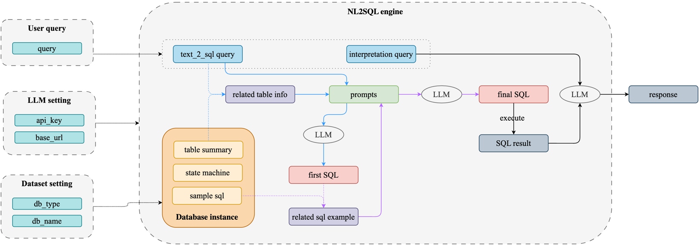

# DIN

它的核心思想是将复杂的 SQL 生成任务分解为更简单的子任务，并使用这些子任务的解决方案作为提示，逐步引导模型生成最终的 SQL 查询。

[paper](https://arxiv.org/abs/2304.11015)

### **DIN-SQL 的详细工作流程：**
<p align="center">
  
</p>
1. **问题理解（Question Understanding）**
2. **任务分解（Task Decomposition）**
3. **子任务解决（Subtask Resolution）+ 嵌套提示（Nested Prompting）**
4. **SQL 组装（SQL Assembly）**

### **步骤 1：问题理解（Question Understanding）**

**目的：** 从自然语言查询中提取关键信息。

**输入：**用户的自然语言查询。

**过程：**使用 LLM 或专门的解析工具，从查询中提取出：

- **目标列（Select Columns）：** 要查询的字段。
- **数据表（Tables）：** 涉及的数据库表。
- **条件（Conditions）：** 过滤条件、WHERE 子句。
- **操作（Operations）：** 聚合函数、排序、分组等。

```python
你是一名专业的数据库分析师，擅长从自然语言查询中提取关键信息。

用户的查询是：{query}

请从上述查询中提取以下信息：

1. **目标列（Select Columns）**（需要选择的字段或计算的值）
2. **涉及的数据表（Tables）**
3. **过滤条件（Conditions）**（WHERE 条件）
4. **操作（Operations）**（如聚合函数、排序、分组等）

Example:
用户 query："获取销售额超过 100,000 的所有销售人员的姓名和总销售额，并按照总销售额降序排列。"
输出：{
    'select_columns': ['salesperson_name', 'SUM(sales_amount) AS total_sales'],
    'tables': ['sales_records'],
    'conditions': ['SUM(sales_amount) > 100000'],
    'operations': {
        'aggregation': True,
        'group_by': ['salesperson_name'],
        'order_by': {'column': 'total_sales', 'direction': 'DESC'}
    }
}

请按照以下格式提供您的回答：

- 目标列：
- 数据表：
- 过滤条件：
- 操作：
```

**输出：**一个结构化的表示，包含从查询中提取的关键元素。

### 步骤 2：任务分解（Task Decomposition）

**目的：** 将复杂的 SQL 生成任务分解为一系列更简单的子任务。

**输入：**从步骤 1 提取的关键元素。

**过程：**根据 SQL 查询的组成部分，将任务分解为以下子任务：

1. **确定 SELECT 子句**
2. **确定 FROM 子句**
3. **构建 WHERE 子句**
4. **构建 GROUP BY 子句**
5. **构建 HAVING 子句**（如果涉及聚合条件）
6. **构建 ORDER BY 子句**

```python
# 示例：从步骤 1 中提取的关键元素
extracted_elements = {
    'select_columns': ['salesperson_name', 'SUM(sales_amount) AS total_sales'],
    'tables': ['sales_records'],
    'conditions': ['SUM(sales_amount) > 100000'],
    'operations': {
        'aggregation': True,
        'group_by': ['salesperson_name'],
        'order_by': {'column': 'total_sales', 'direction': 'DESC'}
    }
}

def task_decomposition(extracted_elements):
    subtasks = []

    # Task 1：Generate a SELECT clause
    if extracted_elements.get('select_columns'):
        subtasks.append('Generate a SELECT clause')

    # Task 2：确定 FROM 子句
    if extracted_elements.get('tables'):
        subtasks.append('确定 FROM 子句')

    # Task 3：构建 WHERE 子句
    # 假设条件中不包含聚合函数的部分用于 WHERE 子句
    where_conditions = []
    having_conditions = []
    if extracted_elements.get('conditions'):
        for condition in extracted_elements['conditions']:
            if any(func in condition.upper() for func in ['SUM', 'COUNT', 'AVG', 'MAX', 'MIN']):
                having_conditions.append(condition)
            else:
                where_conditions.append(condition)
        if where_conditions:
            subtasks.append('构建 WHERE 子句')

    # 子任务 4：构建 GROUP BY 子句
    if extracted_elements['operations'].get('group_by'):
        subtasks.append('构建 GROUP BY 子句')

    # 子任务 5：构建 HAVING 子句
    if having_conditions:
        subtasks.append('构建 HAVING 子句')

    # 子任务 6：构建 ORDER BY 子句
    if extracted_elements['operations'].get('order_by'):
        subtasks.append('构建 ORDER BY 子句')

    return subtasks

# 执行任务分解
subtasks = task_decomposition(extracted_elements)

# 输出子任务列表
print("需要完成的子任务列表：")
for idx, task in enumerate(subtasks, 1):
    print(f"{idx}. {task}")
```

**输出：**子任务列表，每个子任务将在后续步骤中单独解决。

### **步骤 3：子任务解决（Subtask Resolution）**

**目的：** 使用 LLM 逐个解决每个子任务。

**过程：**为每个子任务构建专门的提示（prompt），包含之前的上下文信息，引导模型生成正确的输出。

```python
PROMPT = """
You are an expert SQL query builder. Based on the user's request, perform the following subtask:

**Subtask:** {subtask_name}

User's request: "{user_query}"

Previous selections:
{previous_selections}

Question: {subtask_question}

{output_format}

Answer:
"""

user_query = "Retrieve the names and total sales of all salespeople with sales exceeding 100,000, and sort the results in descending order of total sales."
```

- **Subtask 1: Generate the SELECT Clause**

  ```python
  subtask_name = "Generate the SELECT clause"
  subtask_question = "Which columns and aggregation functions should be included in the SELECT clause?"
  output_format = "Please provide the output in JSON format with the key 'select_columns'."
  ```

  Expected LLM Output (JSON):

  ```json
  {
    "select_columns": [
      "salesperson_name",
      "SUM(sales_amount) AS total_sales"
    ]
  }
  ```

- **Subtask 2: Determine the FROM Clause**

  ```python
  subtask_name = "Determine the FROM clause"
  subtask_question = "Which table should be used in the FROM clause?"
  output_format = "Please provide the output in JSON format with the key 'from_table'."
  
  # Assume previous_selections includes the output from Subtask 1
  previous_selections = {
    "select_columns": [
      "salesperson_name",
      "SUM(sales_amount) AS total_sales"
    ]
  }
  ```

  Expected LLM Output (JSON):

  ```python
  {
    "from_table": "sales_records"
  }
  ```

- **Subtask 3: Construct the GROUP BY Clause**

  ```python
  subtask_name = "Construct the GROUP BY clause"
  subtask_question = "Is a GROUP BY clause needed? If so, which columns should be used for grouping?"
  output_format = "Please provide the output in JSON format with the key 'group_by_columns'."
  
  # Update previous_selections with outputs from Subtask 2
  previous_selections.update({
    "from_table": "sales_records"
  })
  ```

  Expected LLM Output (JSON):

  ```python
  {
    "group_by_columns": ["salesperson_name"]
  }
  ```

- **Subtask 4: Construct the HAVING Clause**

  ```python
  subtask_name = "Construct the HAVING clause"
  subtask_question = "Is a HAVING clause needed? If so, what conditions should it contain?"
  output_format = "Please provide the output in JSON format with the key 'having_conditions'."
  
  # Update previous_selections with outputs from Subtask 3
  previous_selections.update({
    "group_by_columns": ["salesperson_name"]
  })
  ```

  Expected LLM Output (JSON):

  ```python
  {
    "having_conditions": ["SUM(sales_amount) > 100000"]
  }
  ```

- **Subtask 5: Construct the ORDER BY Clause**

  ```python
  subtask_name = "Construct the ORDER BY clause"
  subtask_question = "Is an ORDER BY clause needed? If so, how should the results be ordered?"
  output_format = "Please provide the output in JSON format with the key 'order_by'."
  
  # Update previous_selections with outputs from Subtask 4
  previous_selections.update({
    "having_conditions": ["SUM(sales_amount) > 100000"]
  })
  ```

  Expected LLM Output (JSON):

  ```python
  {
    "order_by": {
      "column": "total_sales",
      "direction": "DESC"
    }
  }
  ```

**Combining All Subtask Outputs**

```python
previous_selections.update({
  "order_by": {
    "column": "total_sales",
    "direction": "DESC"
  }
})
{
  "select_columns": [
    "salesperson_name",
    "SUM(sales_amount) AS total_sales"
  ],
  "from_table": "sales_records",
  "group_by_columns": ["salesperson_name"],
  "having_conditions": ["SUM(sales_amount) > 100000"],
  "order_by": {
    "column": "total_sales",
    "direction": "DESC"
  }
}
```

### **步骤 4：SQL 组装（SQL Assembly）**

```python
# Build SELECT clause
select_clause = f"SELECT {', '.join(subtask_outputs['select_columns'])}"

# Build FROM clause
from_clause = f"FROM {subtask_outputs['from_table']}"

# Build GROUP BY clause
group_by_clause = ""
if 'group_by_columns' in subtask_outputs:
    group_by_clause = f"GROUP BY {', '.join(subtask_outputs['group_by_columns'])}"

# Build HAVING clause
having_clause = ""
if 'having_conditions' in subtask_outputs:
    having_clause = f"HAVING {' AND '.join(subtask_outputs['having_conditions'])}"

# Build ORDER BY clause
order_by_clause = ""
if 'order_by' in subtask_outputs:
    order_by = subtask_outputs['order_by']
    order_by_clause = f"ORDER BY {order_by['column']} {order_by['direction']}"

# Combine clauses
sql_query = "\\n".join([clause for clause in [
    select_clause,
    from_clause,
    group_by_clause,
    having_clause,
    order_by_clause
] if clause]) + ";"

print(sql_query)
```

Resulting SQL Query:

```sql
SELECT salesperson_name, SUM(sales_amount) AS total_sales
FROM sales_records
GROUP BY salesperson_name
HAVING SUM(sales_amount) > 100000
ORDER BY total_sales DESC;
```